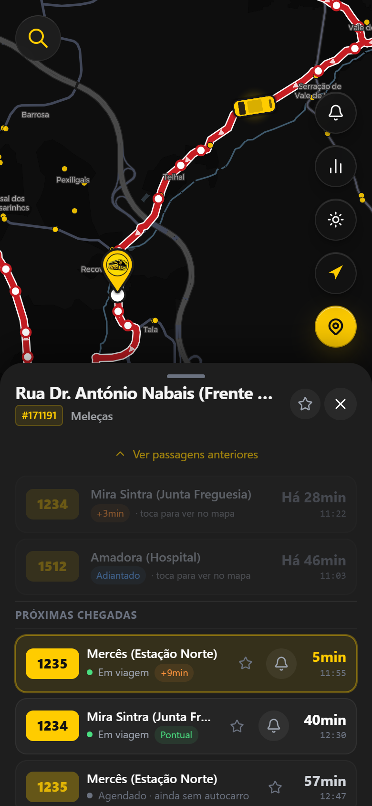
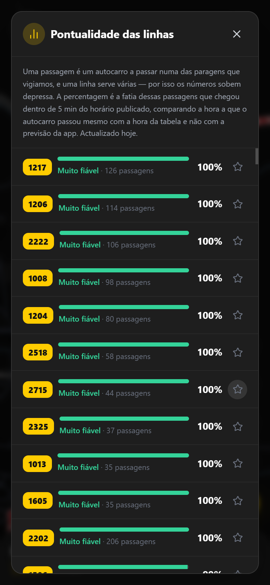
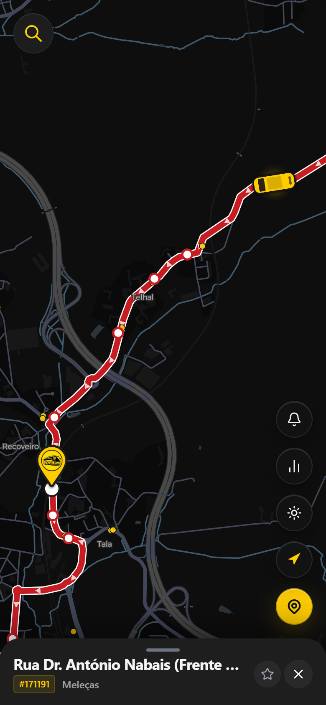
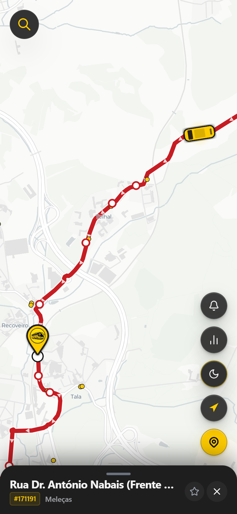

# Bus Lisbon

Real-time bus tracker for **Carris Metropolitana**, the operator that runs the
buses around Lisbon. It is a Progressive Web App on the front, a C# API on
Azure behind it, and it needs no account, no SMS and no money to use.

**Live:** [buslisbon.vercel.app](https://buslisbon.vercel.app)

<p align="center">
  
  &nbsp;
  
</p>

---

## Why I built this

The official Carris Metropolitana site and app were often down or would not
load when my friends and I tried to check a bus. I noticed the public API kept
answering even while the site was broken, so I started building my own thing on
top of it.

It began as bus positions on a map. Then arrival times, then alerts, then the
whole backend moved to C#, and then the map was rewritten. Each of those is a
milestone in the issues with a release attached, if you want to see how it got
here.

---

## What it does

- **Follow a bus.** Pick a stop, pick an arrival, and the bus is on the map
  turning with its heading and sliding to each new position. The map frames
  your stop and the bus together and tightens as it gets closer.
- **Arrival times that behave.** The countdown ticks smoothly, the minutes
  always agree with the clock time next to them, and there is a badge when the
  feed has gone stale — iOS freezes timers in the background and you should
  know when what you are reading is old.
- **Alerts without an account.** Tap the bell on an arrival, choose how early
  you want to know, and a push notification arrives when the bus is that close.
  The push subscription is the device identity, so there is nothing to sign up
  for. Tapping the notification opens the app on that stop with the route drawn.
- **Which lines you can trust.** A ranking of 272 lines by how often they arrive
  within five minutes of the timetable, built from passages the backend collects
  every night.
- **Search** across the roughly 12,700 stops in the system, and favourites.
- **Installable and offline-ish.** It goes on the home screen, keeps the stops
  cached, and opens without a connection.

---

## Why there is a C# backend

The first version did what most small apps do: the browser pulled the entire
vehicle feed every eight seconds and filtered it down to the one bus you were
watching.

```text
GET /v2/vehicles     ~163 KB gzipped, 1694 vehicles
every 8 seconds, filtered in the browser to keep 1
10 minutes of following a bus  ->  ~12 MB
```

Twelve megabytes of mobile data to watch one bus. The backend exists to answer
that question directly:

```text
GET /api/vehicles/{id}   ~254 bytes
same 10 minutes          ->  ~19 KB
```

Roughly six hundred times less. That is the whole argument, and it is also why
the API is not a CRUD app: it is a cache in front of somebody else's feed, a
SignalR stream that pushes positions instead of being polled, and two scheduled
jobs.

One thing worth saying because it limits everything else: the newest vehicle
timestamp in the Carris feed runs about 55 seconds behind real time, checked
against their own `Date` header. No architecture fixes that. The ceiling is at
the source.

---

## How it fits together

```text
        +---------------------------+
        |  Browser / iOS PWA        |
        |  React, Vite, MapLibre    |
        |  service worker + push    |
        +------+-------------+------+
               |             |
   stops, patterns,          |  one bus, alerts, ranking
   shapes (direct)           |  + SignalR stream
               |             |
               v             v
   +-----------------+   +--------------------------------+
   | Carris public   |   | BusLisbon.Api                  |
   | API             |<--| Azure Container Apps, scale-to-0|
   +-----------------+   |   /api/vehicles/{id}           |
               ^         |   /api/vehicles/by-line/{id}   |
               |         |   /api/alerts                  |
               |         |   /api/lines/reliability       |
               |         |   /hubs/vehicles  (SignalR)    |
               |         +----------------+---------------+
               |                          |
               |                  +-------+--------+
               |                  |                |
               |          +-------v------+  +------v-------+
               |          | Azure SQL    |  | Upstash      |
               |          | observed     |  | alerts +     |
               |          | passages     |  | published    |
               |          +-------^------+  | ranking      |
               |                  |         +------^-------+
               |                  |                |
   +-----------+------------------+----------------+-------+
   | Container Apps Jobs (cron)                            |
   |   AlertJob       every minute: due alerts -> web-push |
   |   CollectionJob  nightly: passages -> SQL -> ranking  |
   +-------------------------------------------------------+
```

A few decisions worth explaining:

**The container scales to zero.** Idle billing on the smallest size costs more
per month than everything else combined, and this runs on a student credit. The
price is a cold start of about twenty seconds, so the app is built to survive
one: the frontend still talks to Carris directly for anything that does not
need the backend, and shows the backend's own wake-up state instead of hanging.

**The ranking is not read from SQL.** The free database pauses after an hour
idle and the first connection back fails and takes most of a minute. The
nightly job publishes one document to the key-value store the alerts already
use, and the API serves that. Warm, the whole ranking answers in 0.37s.

**No accounts.** The push subscription identifies the device. Nothing to log
into, nothing personal to store.

---

## The map

It used to be Leaflet over raster tiles. Two problems: panning was a grid of
images being swapped, and the tile URL pointed at `mt1.google.com`, which is
Google's internal endpoint and not something a public app may use.

It is MapLibre now, with free CARTO vector tiles and no key. Everything on top
is a layer: stops as circles sized the way the operator sizes theirs, the route
as a line with direction arrows drawn along it, the chosen stop as a pin, the
bus as a rotated symbol, your own position as a dot. Taps are answered from
what is actually drawn, so a stop under a route line is still the stop you hit.

<p align="center">
  
  &nbsp;
  
</p>

The cost is real and worth writing down: gzipped JavaScript went from 147 KB to
345 KB, because MapLibre is much heavier than Leaflet. Loading the map lazily
would win most of that back and is not done yet.

---

## Things that were harder than they looked

**Carris returns the whole service day for a stop, past arrivals included.** The
alert check has to skip what already happened and take the next future one,
otherwise it decides the bus went by hours ago and cancels the alert.

**Buses run past midnight.** The GTFS feed writes those trips as `24:34:02`,
not `00:34:02` the next day. Naive parsing put the first observed passages a day
early, which the collection then compared against the wrong schedule.

**MapLibre keeps the padding you give `easeTo`.** It sits on the transform
afterwards, so the next `fitBounds` adds the same padding a second time. With a
bottom sheet covering 55% of a phone screen that is more padding than the screen
has, and the map silently refuses to move. It only ever showed on phones.

**The worker is not bundled for you.** MapLibre builds its worker URL at runtime
from `import.meta.url`, so the bundler never sees the string, never emits the
file, and the deployed app gets a 404 and a black canvas. The dev server hides
it completely, because it serves the package from `node_modules`.

**Layer order is not what you assume.** Inserting map layers before the first
symbol layer in the style puts them under the roads in CARTO positron, which
paints tarmac over the stops. Dark matter puts its first symbol layer much
later, so the same code looks fine on one theme and broken on the other.

---

## Tech stack

| Layer | Choice |
|---|---|
| Frontend | React 19, TypeScript, Vite, Tailwind |
| Map | MapLibre GL JS with CARTO vector tiles |
| Data fetching | SWR, plus a SignalR client for live positions |
| Backend | .NET 10, ASP.NET Core Minimal API |
| Data access | EF Core against Azure SQL |
| Background work | Two Azure Container Apps Jobs on cron |
| Key-value store | Upstash Redis, over its REST API |
| Push | web-push with VAPID, no third-party service |
| Hosting | Vercel for the app, Azure Container Apps for the API |
| Tests | Vitest on the front, xUnit on the back |
| Source of truth | api.carrismetropolitana.pt, public, no key |

---

## What is in the repo

```text
backend/
  src/
    BusLisbon.Api/            Minimal API, SignalR hub, EF Core model
    BusLisbon.AlertJob/       cron job: due alerts -> web-push
    BusLisbon.CollectionJob/  cron job: passages -> SQL -> ranking
  tests/
    BusLisbon.Api.Tests/      174 tests, SQLite in memory

src/
  components/
    VectorMap.tsx             the map: sources, layers, camera
    MapControls.tsx           the floating buttons
    StopDetailsPanel.tsx      the bottom sheet: arrivals, bells
    SearchBar.tsx             stop search, shrinks to an icon
    AlertsPanel.tsx           pending alerts
    ReliabilityPanel.tsx      the line ranking
  services/
    api.ts                    Carris hooks
    gateway.ts                our own API
    realtime.ts               SignalR stream
    stopsLayer.ts             stop geometry and sizing
    routeLayer.ts             route line, arrows, waypoints
    vehicleLayer.ts           the bus marker and its movement
    framing.ts                what the camera should be looking at
    userLocation.ts           permission and the blue dot
    reliability.ts            ranking client

.github/workflows/            frontend checks, backend build and deploy,
                              and a scheduled check that the Carris API
                              still looks the way we expect
```

---

## Running it

The frontend on its own talks straight to Carris and works without the backend,
minus the live stream, the alerts and the ranking:

```bash
npm install
npm run dev
```

With the backend, from PowerShell — Git Bash rewrites `/gw` into a Windows path
and the app ends up fetching from a file:

```powershell
cd backend/src/BusLisbon.Api
dotnet run                      # http://localhost:5058

$env:VITE_GATEWAY_PROXY_TARGET = "http://localhost:5058"
$env:VITE_GATEWAY_BASE = "/gw"
npm run dev
```

The proxy exists because the deployed API only allows its production origin.

For the alerts you need VAPID keys and an Upstash database. See
[`docs/PUSH_NOTIFICATIONS_SETUP.md`](docs/PUSH_NOTIFICATIONS_SETUP.md).

---

## License

[MIT](LICENSE) 2026 Kennedy Silva ([KennedySilva8907](https://github.com/KennedySilva8907))
